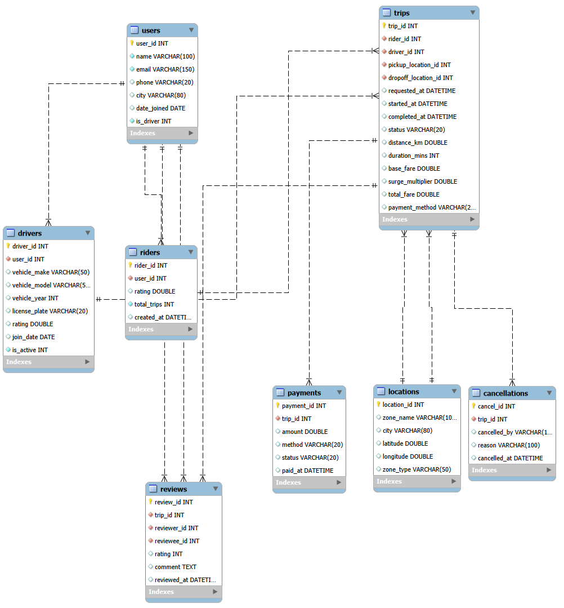

# 🚖 Uber Operations & Revenue Analysis

<p align="center">
  
</p>

<p align="center">


</p>

---

# 📖 Project Description

This project analyzes operational and financial data from a ride-hailing platform similar to **Uber**.

The objective is to transform raw transactional data into actionable business insights by applying SQL for data analysis and Power BI for interactive visualization.

The project follows an end-to-end analytics workflow, from data quality assessment and exploratory data analysis (EDA) to KPI development, business analysis, dashboard creation, and strategic recommendations.

---

# 💼 Business Problem

Ride-hailing platforms process thousands of trips every day.

To remain competitive, they must understand:

- Where revenue is generated.
- Which cities produce the highest demand.
- How drivers perform.
- How riders behave.
- Why trips are cancelled.
- Which operational factors impact profitability.

This project simulates the work of a Data Analyst supporting business decision-making through data-driven insights.

---

# 🎯 Objectives

- Assess data quality before analysis.
- Perform Exploratory Data Analysis (EDA).
- Calculate key business KPIs.
- Analyze operational performance.
- Evaluate financial performance.
- Analyze driver performance.
- Analyze rider behavior.
- Build an executive Power BI dashboard.
- Generate business recommendations supported by data.

---

# 🗂 Dataset Overview

The database contains information about:

- Trips
- Drivers
- Riders
- Locations
- Payments
- Reviews

### Database Schema

> *(Entity Relationship Diagram will be added here.)*

<p align="center">

</p>

---

# 🛠 Tools & Technologies

| Tool | Purpose |
|-------|----------|
| SQL (MySQL) | Data extraction and analysis |
| Power BI | Dashboard development |
| Excel | Data validation and support |
| Git | Version control |
| GitHub | Portfolio and documentation |

---

# 🔄 Project Workflow

```text
Business Understanding
        │
        ▼
Data Understanding
        │
        ▼
Data Quality Assessment
        │
        ▼
Exploratory Data Analysis
        │
        ▼
KPI Development
        │
        ▼
Business Analysis
        │
        ▼
Power BI Dashboard
        │
        ▼
Business Recommendations
```

---

# 📂 Repository Structure

```text
Uber-Operations-Revenue-Analysis/
│
├── README.md
│
├── data/
│   ├── raw/
│   └── processed/
│
├── sql/
│   ├── 01_data_quality.sql
│   ├── 02_eda.sql
│   ├── 03_kpis.sql
│   ├── 04_operational_analysis.sql
│   ├── 05_financial_analysis.sql
│   ├── 06_driver_analysis.sql
│   └── 07_rider_analysis.sql
│
├── powerbi/
│   └── Uber_Dashboard.pbix
│
├── images/
│   ├── dashboard.png
│   ├── erd.png
│   └── charts/
│
├── docs/
│   ├── data_dictionary.pdf
│   └── executive_report.pdf
│
└── LICENSE
```

---

# 📊 Analysis Roadmap

| Phase | Status |
|---------|:------:|
| Data Quality Assessment | ⬜ |
| Exploratory Data Analysis | ⬜ |
| KPI Development | ⬜ |
| Operational Analysis | ⬜ |
| Financial Analysis | ⬜ |
| Driver Analysis | ⬜ |
| Rider Analysis | ⬜ |
| Dashboard Development | ⬜ |
| Business Recommendations | ⬜ |

---

# 📈 Dashboard Preview

> *(Dashboard screenshots will be added after the Power BI development.)*

<p align="center">

</p>

---

# 💡 Key Insights

The main findings will be documented here after completing the analysis.

Examples:

- Peak demand periods.
- Revenue distribution.
- Top-performing drivers.
- Rider behavior patterns.
- Cancellation trends.
- Revenue by city.

---

# 📌 Business Recommendations

Based on the analysis, this section will provide actionable recommendations focused on:

- Revenue optimization.
- Operational efficiency.
- Driver performance.
- Customer experience.
- Demand management.

---

# 🚀 How to Run

1. Import the database into MySQL.
2. Execute the SQL scripts located in the **sql/** folder.
3. Open the Power BI file located in **powerbi/**.
4. Refresh the data model.
5. Explore the interactive dashboard.

---

# 👨‍💻 Author

**Christian Mederos**

Industrial Engineer | Data Analyst

📍 Santa Catarina, Brazil

GitHub: *(Coming Soon)*

LinkedIn: *(Coming Soon)*

---

# ⭐ Project Status

🚧 **In Progress**

This repository is being developed as part of my professional Data Analytics portfolio. New analyses, dashboards, and documentation will be added progressively.
