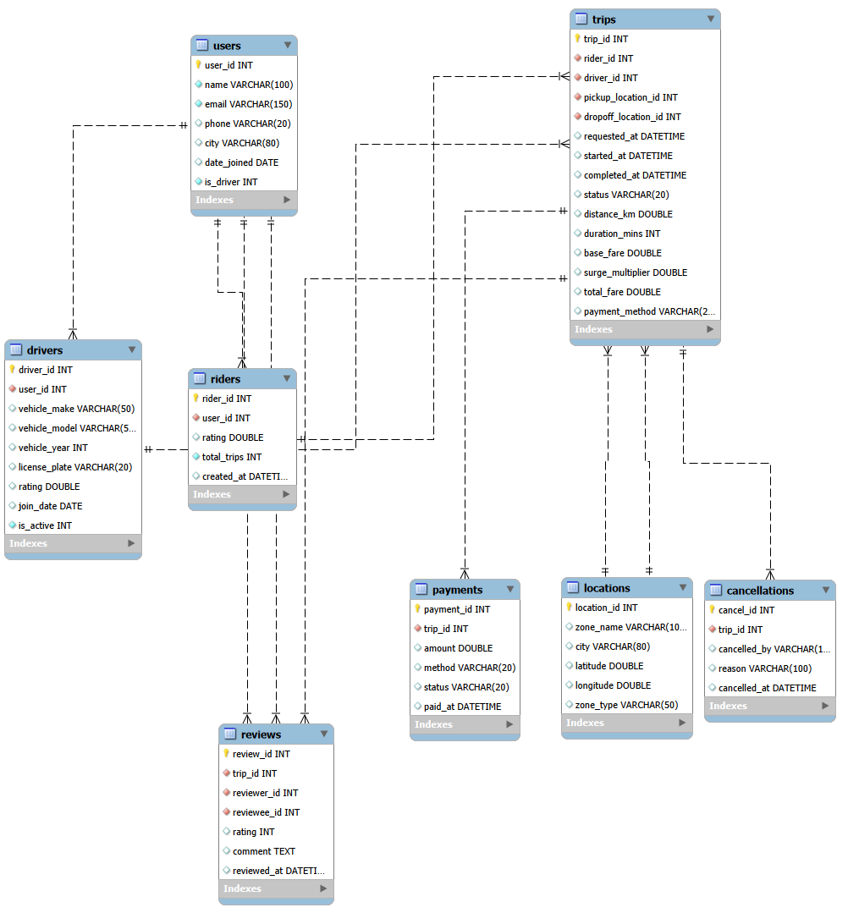

## 🚖 Uber Operations & Revenue Analysis

<p align="center">
  
</p>

<p align="center">


</p>

---

# 📖 Project Description

This project analyzes operational and financial data from a ride-hailing platform similar to **Uber**.

The objective is to transform raw transactional data into meaningful business insights using SQL for data analysis and Power BI for visualization.

The project follows a complete analytics workflow that includes data quality assessment, exploratory data analysis (EDA), KPI development, business performance evaluation, dashboard creation, and strategic recommendations.

---

# 💼 Business Problem

Ride-hailing platforms process thousands of trips every day.

To remain competitive, they must understand:

- Where revenue is generated.
- Which cities produce the highest demand.
- How drivers perform.
- How riders behave.
- Why trips are cancelled.
- Which operational factors impact profitability.

This project simulates the work of a Data Analyst supporting business decision-making through data-driven insights.

---

# 🎯 Objectives

- Assess data quality.
- Perform Exploratory Data Analysis (EDA).
- Develop business KPIs.
- Answer key business questions using SQL.
- Build an interactive Power BI dashboard.
- Generate actionable business recommendations.

---

# 🗂 Dataset Overview

The database contains information about:

- Trips
- Drivers
- Riders
- Locations
- Payments
- Reviews

## Database Schema



---

# 🛠 Tools & Technologies

| Tool | Purpose |
|-------|----------|
| SQL (MySQL) | Data extraction and analysis |
| Power BI | Dashboard development |
| Excel | Data validation and support |
| Git | Version control |
| GitHub | Portfolio and documentation |

---

# 🔄 Project Workflow

```text
Business Understanding
        │
        ▼
Data Understanding
        │
        ▼
Data Quality Assessment
        │
        ▼
Exploratory Data Analysis
        │
        ▼
KPI Development
        │
        ▼
Business Analysis
        │
        ▼
Power BI Dashboard
        │
        ▼
Business Recommendations
```

---

# ✅ Project Completion

The end-to-end analytics workflow has been completed, including:

- Data Quality Assessment
- Exploratory Data Analysis (EDA)
- KPI Development
- Financial Performance Analysis
- Driver Performance Analysis
- Operational Performance Analysis
- Cancellation Analysis
- Rider Behavior Analysis
- Service Quality Analysis
- Power BI Dashboard Development
- Business Recommendations---

# 📌 Business Questions

The complete list of business questions analyzed throughout this project is available in:

📄 **docs/business_questions.md**

The analysis covers:

- Financial Performance
- Driver Performance
- Operational Performance
- Cancellation Analysis
- Rider Behavior
- Service Quality

---

# 📂 Repository Structure

```text
Uber-Operations-Revenue-Analysis/
│
├── README.md
│
├── data/
│   ├── raw/
│   └── processed/
│
├── sql/
│   ├── 01_data_quality.sql
│   ├── 02_eda.sql
│   ├── 03_kpis.sql
│   └── 04_dashboard_queries.sql
│
├── powerbi/
│   └── Uber_Operations_Revenue_Analysis.pbix
│
├── docs/
│   ├── business_questions.md
│   ├── data_dictionary.md
│   ├── database_schema.md
│   └── screenshots/
│       ├── Page 1.PNG
│       ├── Page 2.PNG
│       ├── Page 3.PNG
│       └── Page 4.PNG
│
└── images/
```

---

# 📊 Analysis Roadmap

| Phase                     | Status |
| ------------------------- | :----: |
| Data Quality Assessment   |   ✅   |
| Exploratory Data Analysis |   ✅   |
| KPI Development           |   ✅   |
| Financial Analysis        |   ✅   |
| Driver Analysis           |   ✅   |
| Operational Analysis      |   ✅   |
| Cancellation Analysis     |   ✅   |
| Rider Analysis            |   ✅   |
| Service Quality Analysis  |   ✅   |
| Dashboard Development     |   ✅   |
| Business Recommendations  |   ✅   |
---
# 📈 Dashboard Preview

## Executive Overview


## Driver Analysis


## Operational Analysis


## Rider Analysis


# 💡 Key Findings

The analysis identified several important business insights:

- Houston generates the highest total revenue among the analyzed cities.
- Los Angeles records the highest average fare.
- Airport-related pickup zones contribute significantly to revenue generation.
- Flushing is one of the busiest pickup zones by trip volume.
- Payment methods are distributed relatively evenly across card, wallet, and cash.
- Cancellation rates vary by city and are influenced by operational conditions.
- Driver performance shows meaningful variation in both revenue generation and ratings.
- A small group of riders contributes disproportionately to total rider revenue.
---

# 📌 Business Recommendations

Based on the analysis, the following actions are recommended:

- Prioritize operational and marketing efforts in high-revenue cities such as Houston and Los Angeles.
- Strengthen driver availability during peak demand hours to reduce unmet demand and improve service levels.
- Monitor cities and operational conditions with higher cancellation rates to identify preventable causes.
- Focus on high-demand pickup zones, especially airport and central urban areas, when allocating driver supply.
- Develop retention strategies for high-value riders who contribute a disproportionate share of revenue.
- Track driver revenue and ratings together to identify high-performing drivers and potential service quality issues.
- Maintain multiple payment options, as card, wallet, and cash usage is relatively balanced across the platform.
---

# 🚀 How to Run

1. Import or restore the Uber database in MySQL.
2. Execute the SQL scripts located in the **sql/** folder.
3. Export the dashboard query results to CSV files.
4. Place the exported CSV files in the appropriate **data/** folder.
5. Open `Uber_Operations_Revenue_Analysis.pbix` from the **powerbi/** folder.
6. Update the data source paths if necessary.
7. Refresh the Power BI data model.
8. Explore the interactive dashboard pages.
---

# 👨‍💻 Author

**Christian Mederos**

Industrial Engineer | Data Analyst

📍 Santa Catarina, Brazil

### Skills Demonstrated

- SQL
- MySQL
- Data Cleaning
- Data Quality Assessment
- Exploratory Data Analysis (EDA)
- KPI Development
- Business Analysis
- Window Functions
- Common Table Expressions (CTEs)
- Power BI
- Data Visualization
- Excel
- Git
- GitHub

---

# ⭐ Project Status

✅ **Completed**

This project is part of my professional Data Analytics portfolio and demonstrates an end-to-end analytics workflow using SQL, Power BI, Excel, Git, and GitHub.

The completed project includes:

- Data Quality Assessment
- Exploratory Data Analysis
- KPI Development
- Financial Performance Analysis
- Driver Performance Analysis
- Operational Performance Analysis
- Cancellation Analysis
- Rider Behavior Analysis
- Service Quality Analysis
- Interactive Power BI Dashboard
- Business Recommendations
